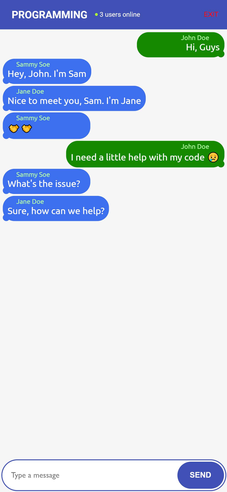

## About
> This is a simple chat application built with Pusher and Vue. It is a part of a tutorial series on how to build a group chat application with Pusher and Vue. You can find the tutorial [here](https://dev.to/leighola/how-to-create-fast-scalable-group-chat-functionality-with-pusher-and-vue-4i1g).

## Setup

- Step 1: Install dependencies
```cmd
cd pusher-backend
npm i cors dotenv express pusher
```

- Step 2: Start the server
```cmd
node app.js
```

- Step 3: Head to your browser and open http://localhost:3000

## Screenshots


