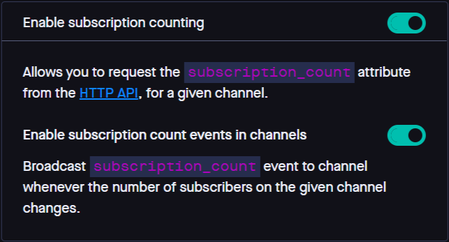

## Implementing speedy group chat functionality with Pusher and Vue.

 [Pusher](https://www.pusher.com) is a tool that enables you to build scalable real-time communication. Fast.

Pusher is used by industry giants such as [The Washington Post](https://www.washingtonpost.com/), [DoorDash](https://www.doordash.com/) and [MailChimp](https://mailchimp.com/) 
 

## Table Of Contents
  * [Features](#features)
  * [Requirements](#requirements)
  * [Setting up Pusher](#setting-up-pusher)
    * [Creating a pusher channel](#creating-pusher-channel) 
    * [Getting your App Keys](#get-app-keys) 
    * [Enabling subscription counting](#subscription-counting) 
  * [Setting up NodeJS Backend](#nodejs-setup)
    * [Packages](#packages) 
    * [Adding your App Keys](#add-app-keys) 
    * [Creating an Express server](#create-server) 
    * [Messaging with Pusher](#handling-messages-with-pusher) 
  * [Setting up Vue Frontend](#vue-setup)
    * [Instantiating Vue and Pusher](#instantiating) 
      * [Opening a channel](#open-channel) 
    * [Sending messages](#sending-messages) 
    * [Disconnecting from a channel](#disconnecting) 
    * [Creating and styling HTML](#HTML-and-css) 
  * [Results](#results) 

## Features <a name="features"></a>

In this tutorial, We will use Pusher & Vue to build a very simple chat app that enables fast, real-time group messaging across multiple users.

Users will be able to create a username, join a group, and send and receive messages to/from all other online users in the group.

This app will have its backend built with NodeJS and Express, and its frontend built with Pusher and Vue.

## Requirements <a name="requirements"></a>
You will need:
- Basic [NodeJS](https://nodejs.org) experience
- Basic [Vue](https://vuejs.org) experience
- A Pusher account. More on that in the next section.

## Setting up Pusher <a name="setting-up-pusher"></a>
### Step 1: Creating a Pusher Channel <a name="creating-pusher-channel"></a>
- [Sign up](https://dashboard.pusher.com/accounts/sign_up) for a Pusher account.
- Next, head over to [channels](https://dashboard.pusher.com/channels) and click on "Create App".
- Provide the following information:
  - **App Name**:  This will be the name of the app on your pusher dashboard.
  - **Cluster**: This is the location of the servers that will handle requests from your app. Choose a location nearest to you.
  - **Tech stack**: This is optional. We'll use **Vue.js** for our frontend and **Node.js** for our backend.

Your setup configurations should look something like this:

Click on **Create App** to continue.
### Step 2: Get your App Keys <a name="get-app-keys"></a>
To use Pusher channels, you need App Keys for your app.
- Head over to the **App Keys** section on your Pusher App dashboard.
- Copy your `app_id`, `key`, `secret` and `cluster`. 

### Step 3: Enabling subscription counting. <a name="subscription-counting"></a>
[Subscription count](https://blog.pusher.com/counting-live-users-at-scale-with-subscription-count-events/) is an in-built pusher event that lets you know how many clients are connected to a single channel.

If this feature is enabled, Pusher will publish a **subscription_count** event whenever the number of subscribers on a given channel changes.

Here's how to enable this feature:
- From your Pusher App dashboard, head over to **App Settings**.
- Scroll down and toggle the switches to **Enable subscription counting** and **Enable subscription count events in channels**


## Setting up the NodeJS backend <a name="nodejs-setup"></a>
### Step 1: Install packages <a name="packages"></a>
Run the following command to install the dependencies we'll need
```cmd
npm i cors dotenv express pusher
```
### Step 2: Add app keys to your project <a name="add-app-keys"></a>
Create a `.env` file in your server directory and paste the Pusher app keys you copied earlier
```json
app_id = "1499155"
key = "326ba7284eae570f59ac"
secret = "0919a7fb769182a2ef69"
cluster = "eu"
Remember to change those values to match your own Pusher app keys.
```
### Step 3: Create express server <a name="create-server"></a>
Next, create an `app.js` file in your server directory and add the following code:
```javascript
const express = require("express");
const Pusher = require("pusher");
const cors = require("cors");

require("dotenv").config();
const app = express();
const port = process.env.PORT || 3000;
const { app_id, key, secret, cluster } = process.env;

app.use(express.json());
app.use(cors());
app.use(express.static("public"));

app.listen(port, () => {
  console.log(`Group chat server started at http://localhost:${port}`);

});
```
This sets up a basic express http server and fetches the environment variables
### Step 4: Messaging with Pusher <a name="handling-messages-with-pusher"></a>
Add the below snippet to your `app.js` to connect to your Pusher app:
```javascript
// Setup Pusher
const pusher = new Pusher({
  appId: app_id,
  key,
  secret,
  cluster,
});
```
Next, add the following snippet:
```javascript
// send message data to all clients connected to a channel
function broadcastMessage({ message, sender, timestamp, channel, user_id }) {
  // create "message-in" event for each new message received 
  pusher
    .trigger(channel, "message-in", {
      message,
      sender,
      user_id,
      timestamp,
    })
    .catch((error) => {
      console.log("Error pushing to client:", error);
    });
}

// receive message data from client
app.post("/message", (req, res) => {
  broadcastMessage(req.body);
  res.send("OK");
});
```
This creates an endpoint to receive messages from a connected user, and then broadcast the message to all the users on the channel.

Finally, open up your terminal and run:
```cmd
node app.js
```
> Thats all for NodeJS!

## Setting up the Vue frontend <a name="vue-setup"></a>
Next, create a `/public` in your server directory and in it, create the following files:
- `index.HTML`
- `index.css`
- `index.js`

### Creating a Vue instance and connecting to Pusher <a name="instantiating"></a>
Open up the `index.js` file and add the following code:
```javascript
const PusherAppKey = "d1d37aa9b3e2dd707d91";
const PusherAppCluster = "eu";
var pusher;
var channel;
var user_id;

let app = new Vue({
  el: "#app",
  data() {
    return {
      connectionState: null,
      stage: "subscribe", // subscribe or chat
      //
      username: "",
      usernamePlaceholder: "Username",
      currentChannel: "", // remove this
      onlineUsersCount: 1,
      //
      message: "",
      selectedMessageTimestamp: null,
      messages: [],
      channels: {
        Programming: "programming",
        "Tech News": "tech-news-channel",
        "Dad Jokes": "dad-jokes-channel",
      },
    };
  },
  watch: {
    username(curr, prev) {
      // limit usernames to 20 characters
      if (String(curr).trim().length > 20) this.username = prev;
    },
  },
  beforeMount() {
    // Generate unique user id
    user_id = Math.random().toString(36).substring(2);
    connectToPusher();
    // Watch pusher connection state for changes
    pusher.connection.bind("state_change", (states) => {
      this.connectionState = states.current;
    });
  },
  mounted() {
    this.openChannel();
  },
  methods: {
    verifyInput() {
      if (!this.username) {
        this.usernamePlaceholder = "Please enter a username";
        return false;
      }
      if (!this.currentChannel) return false;
      return true;
    },
    openChannel() {
      // if pusher is not connected, reconnect
      if (this.connectionState !== "disconnected") {
        connectToPusher();
      }
      // ensure inputs are valid before proceeding
      if (!this.verifyInput()) return;
      // subscribe to the chosen channel
      let channelId = this.channels[this.currentChannel];
      channel = pusher.subscribe(channelId);
      // move to the chats screen
      this.stage = "chat";
      // listen for a message events on the channel
      channel.bind("message-in", (data) => {
        // format and add the message to the list
        data.type = data.user_id == user_id ? "outgoing" : "incoming";
        data.dateTime = new Date(data.timestamp).toLocaleString().split(", ");
        this.messages.push(data);
        // scroll to bottom of the chats box after a new message is added
        this.$nextTick(() => {
          let chatsBox = document.querySelector(".chats-box");
          chatsBox.scrollTop = chatsBox.scrollHeight;
        });
      });
      // listen for a subscription count event on the channel
      channel.bind("pusher:subscription_count", (data) => {
        this.onlineUsersCount = data.subscription_count;
      });
    },
  },
});

function connectToPusher() {
  // instantiate Pusher
  pusher = new Pusher(PusherAppKey, {
    cluster: "eu",
  });
}
```

 
- First, we instantiate Vue:
  ```javascript
  let app = new Vue({
  el: "#app",
    // vue instance options...
  });
  ```
- Next, we create a function to instantiate Pusher:
```javascript
  function connectToPusher() {
    // instantiate Pusher
    pusher = new Pusher(PusherAppKey, {
      cluster: PusherAppCluster,
    });
  }
```
  This connects the Pusher client to our Pusher app instance.

  Remember to change `PusherAppKey` and `PusherAppCluster` to match your own [Pusher app key values](#get-app-keys).
- Then we set up a beforeMount hook to:
```javascript
  beforeMount(){
    // Generate unique user id
    user_id = Math.random().toString(36).substring(2);
    connectToPusher();
    // Watch pusher connection state for changes
    pusher.connection.bind("state_change", (states) => {
      this.connectionState = states.current;
    });
  }
```
  This generates a unique user ID for the user, then it calls the `connectToPusher()` function we created earlier.

  Finally, it binds a function to watch for changes to the Pusher instance's connection. 
#### Open Channel <a name="open-channel"></a>
The content of the `openChannel()` method is especially important, so let's go through it.
- First, we subscribe to the specific Pusher channel selected by the user.
```javascript
  channel = pusher.subscribe(channelId);
```
- Then we bind a function to listen for `message-in` events on that channel. This function gets triggered every time there's a new message on the channel. It then adds the message data to our Vue instance.
```javascript
  channel.bind("message-in", (data) => {
    /* some other code */
    this.messages.push(data);
    /* some other code */
  });
```
- Finally, we listen for a `subscription_count` event on the channel. This is a Pusher event that gets automatically triggered each time a client connects to a channel.
```javascript
channel.bind("pusher:subscription_count", (data) => {
      this.onlineUsersCount = data.subscription_count;
});
```
This event allows us to show how many users are online in a channel at any given time.


### Sending Messages <a name="sending-messages"></a>
Add the following function to your Vue instance methods:
```javascript
sendMessage(event) {
  if (event && event.key) {
    if (event.key != "Enter") return;
  }
  if (!this.message) return;
  let channelId = this.channels[this.currentChannel];
  // send a fetch post request
  let data = {
    message: this.message,
    sender: this.username,
    timestamp: new Date().getTime(),
    channel: channelId,
    user_id,
  };
  fetch("/message", {
    method: "POST",
    headers: {
      "Content-Type": "application/json",
    },
    body: JSON.stringify(data),
  })
    .then(() => {
      this.message = "";
    })
    .catch((e) => {
      console.log("Error sending message", e);
    });
}
```
 
- We created an object containing the message data we want to send:
```javascript
let data = {
// 
}
```
- Then we sent the data to our NodeJS server via a POST request to the `/message` endpoint:
```javascript
fetch("/message", {
  method: "POST",
  headers: {
    "Content-Type": "application/json",
  },
  body: JSON.stringify(data),
})
```
Due to our [server-side code](#handling-messages-with-pusher), when this `/message` endpoint is called, the `message-in` event is triggered on the Pusher Channel, with the same data we just sent via our http request.


### Disconnecting from a channel <a name="disconnecting"></a>
Add one final function to your Vue instance methods:
```javascript
disconnect() {
  this.stage = "subscribe";
  this.messages = [];
  this.onlineUsersCount = 1;
  pusher.disconnect();
}
```
This will disconnect from the current channel, clear all the data on our Vue instance related to that channel, and return the user to the group selection menu.

### Creating and styling our HTML  <a name="HTML-and-css"></a>
Go to the `index.js` file and paste this snippet:
```HTML
<!DOCTYPE HTML>
<HTML lang="en">
<head>
    <meta charset="UTF-8">
    <meta http-equiv="X-UA-Compatible" content="IE=edge">
    <meta name="viewport" content="width=device-width, initial-scale=1.0">
    <title>Document</title>
    <link rel="stylesheet" href="./index.css">
</head>
<body>
    <main id="app" v-cloak>
        <div class="subscribe-container" v-show="stage=='subscribe'">
            <header>
                Select A Group
            </header>
            <div class="subscribe-items">
                <div class="subscribe-item" v-for="(v, name) in channels" :class="{selected: currentChannel==name}" @click="currentChannel=name">
                    <span>{{name}}</span>
                </div>
            </div>
            <input type="text" v-model="username" :placeholder="usernamePlaceholder">
            <button :class="{disabled: !username || !currentChannel}" @click="openChannel">Proceed</button>
        </div>

        <div class="chats-container" v-show="stage=='chat'">
            <header>
                <span>{{currentChannel}}</span>
                <small>
                    <ins></ins> {{onlineUsersCount}} users online
                </small>
                
                <button @click="disconnect">EXIT</button>
            </header>

            <div class="chats-box">
                <div class="chat-item" 
                    v-for="({sender, message, timestamp, type, dateTime}, i) in messages" 
                    :class="{out: type=='outgoing', selected: selectedMessageTimestamp==timestamp}"
                    @click="selectedMessageTimestamp=timestamp"
                >
                    <div class="chat-item-content">
                        <div class="username">{{sender}}</div>
                        <span class="chat-message">{{message}}</span>
                    </div>
                    <span class="timestamp">
                        <small v-for="item in dateTime">
                            {{item}}
                        </small>
                    </span>
                </div>
            </div>

            <footer>
                <input type="text" placeholder="Type a message" v-on:keypress="sendMessage($event)" v-model="message" id="message">
                <button id="send" @click="sendMessage">Send</button>
            </footer>
        </div>
    </main>
</body>
<!-- axios -->
<script src="https://unpkg.com/axios/dist/axios.min.js"></script>
<!-- vue -->
<script src="https://cdn.jsdelivr.net/npm/vue@2.7.13"></script>
<!-- pusher -->
<script src="https://js.pusher.com/7.2/pusher.min.js"></script>
<!--  -->
<script src="./index.js"></script>
</HTML>
```
Finally, it's time to style our page. Open up your `index.css` file and insert this:
```css
/* import roboto font */
@import url("https://fonts.googleapis.com/css?family=Roboto:300,400,500,700&display=swap");
/* import ubuntu font */
@import url("https://fonts.googleapis.com/css?family=Ubuntu:300,400,500,700&display=swap");

[v-cloak] {
  visibility: hidden;
}

body {
  padding: 0px;
  margin: 0px;
  font-size: 16px;
  width: 100%;
  position: relative;
  font-family: "Roboto", sans-serif;
}

#app {
  display: flex;
  height: 100vh;
  max-height: 100vh;
  width: 100%;
  max-width: 100vw;
  position: relative;
  background: white;
  top: 0px;
  left: 0px;
  padding: 0px;
}

/* the popup stage */
.subscribe-container {
  border-radius: 5px;
  display: flex;
  flex-flow: column nowrap;
  box-shadow: 5px 5px 4px 0px rgba(0, 0, 0, 0.75);
  border: 2px solid rgba(0, 0, 0, 0.75);
  box-sizing: border-box;
  width: 300px;
  /* height: ; */
  /* height: 300px; */
  max-height: 300px;
  margin: auto;
  overflow: hidden;
}
.subscribe-container header {
  width: 100%;
  height: 50px;
  display: flex;
  justify-content: center;
  align-items: center;
  background-color: rgb(63, 81, 181);
  color: white;
  font-weight: bold;
}
.subscribe-container .subscribe-items {
  width: 100%;
  height: auto;
  display: flex;
  flex-direction: column;
  justify-content: center;
  align-items: center;
  overflow-y: scroll;
}
/* no scrollbar */
.subscribe-container .subscribe-items::-webkit-scrollbar {
  display: none;
}
.subscribe-container .subscribe-items .subscribe-item {
  display: flex;
  flex-direction: column;
  width: 100%;
  justify-content: center;
  align-items: center;
  height: 40px;
  margin: 5px auto;
  width: 96%;
  border-radius: 3px;
  flex-shrink: 0;
  color: rgb(63, 81, 181);
  font-weight: bold;
}
.subscribe-container .subscribe-items .subscribe-item:hover {
  background-color: rgba(63, 81, 181, 0.1);
}
.subscribe-container .subscribe-items .subscribe-item.selected {
  background-color: rgba(63, 81, 181, 0.25);
}
.subscribe-container .subscribe-items .subscribe-item span {
  text-transform: uppercase;
  font-size: 1.1em;
}
.subscribe-container .subscribe-items .subscribe-item small {
  font-size: 0.7em;
}
/* username & submit */
.subscribe-container input {
  background: white;
  height: 40px;
  width: 100%;
  padding: 5px;
  border: none;
  margin-top: 5px;
  text-align: center;
  font-size: 0.85em;
  color: rgb(63, 81, 181);
}
.subscribe-container button {
  width: 100%;
  height: 40px;
  border: none;
  background-color: rgb(21, 138, 1);
  color: white;
  text-transform: uppercase;
  font-size: 1em;
}
.subscribe-container button.disabled {
  background-color: rgba(21, 138, 1, 0.5);
  color: rgba(255, 255, 255, 0.5);
}
.subscribe-container button:active {
  background-color: rgba(21, 138, 1, 0.5);
  color: white;
}

/* the chat stage */
.chats-container {
  display: flex;
  flex-flow: column nowrap;
  width: 100%;
  height: 100%;
  justify-content: space-between;
}

/* chat header */
.chats-container > header {
  display: flex;
  width: 100%;
  height: 50px;
  background-color: rgb(63, 81, 181);
  /* justify-content: space-between; */
  align-items: center;
  padding: 0px 5px 0px 20px;
  color: white;
  box-sizing: border-box;
}
.chats-container > header > span {
  font-weight: bold;
  font-size: 1.1em;
  text-transform: uppercase;
}
.chats-container > header > small {
  /* position: relative; */
  /* right: 30px; */
  margin-left: 10px;
  font-size: 0.7em;
  display: flex;
}
.chats-container > header > small ins {
  width: 5px;
  height: 5px;
  margin: auto 3px;
  content: "";
  flex-shrink: 0;
  display: inline-block;
  border-radius: 100%;
  background: greenyellow;
}
.chats-container > header > button {
  margin-left: auto;
  border: none;
  background: transparent;
  border-radius: 2px;
  font-size: 0.7em;
  color: white;
  text-transform: uppercase;
  padding: 10px;
  color: red;
}
.chats-container > header > button:hover {
  background-color: rgba(0, 0, 0, 0.25);
}
.chats-container > header > button:active {
  color: white;
  background: red !important;
}

/* chat footer */
.chats-container > footer {
  display: flex;
  width: calc(100% - 8px);
  height: 50px;
  flex-shrink: 0;
  justify-content: space-between;
  align-items: center;
  color: white;
  margin: 0px 2px 2px 2px;
  padding: 0px;
  border: 2px solid rgb(63, 81, 181);
  border-radius: 50px;
  overflow: hidden;
  position: relative;
  outline: none;
  bottom: 0px;
  position: fixed;
}
.chats-container > footer * {
  border: none;
}
.chats-container > footer #message {
  background: white;
  width: 100%;
  max-width: calc(100% - 80px);
  height: 100%;
  padding: 18px 15px;
  font-family: "Gill Sans", "Gill Sans MT", Calibri, "Trebuchet MS", sans-serif;
  box-sizing: border-box;
}
.chats-container > footer #message::-webkit-scrollbar {
  display: none;
}
#message,
#message:focus {
  outline: none !important;
}
.chats-container > footer button {
  flex-shrink: 0;
  height: 46px;
  width: 80px;
  margin: auto 2px;
  background: rgb(63, 81, 181);
  color: white;
  border-radius: 50px;
  border: 0px;
  font-weight: bold;
  text-transform: uppercase;
}

/* main chats box */
.chats-container .chats-box {
  flex-grow: 1;
  width: 100%;
  max-height: calc(100% - 108px);
  display: flex;
  overflow: hidden;
  overflow-y: scroll;
  position: fixed;
  top: 50px;
  margin: 0px;
  flex-flow: column nowrap;
  box-sizing: border-box;
  padding: 5px 0px;
  margin-right: 40px;
}
.chats-container .chats-box::-webkit-scrollbar {
  display: none;
}
.chats-box .chat-item {
  width: 100%;
  display: flex;
  box-sizing: border-box;
  padding: 0px 5px;
  justify-content: space-between;
}
.chats-box .chat-item:not(:last-of-type) {
  margin-bottom: 3px;
}
.chats-box .chat-item.selected {
  background: rgba(63, 81, 181, 0.15);
  padding: 2px 5px;
}
.chat-item .chat-item-content {
  position: relative;
  z-index: 2;
  max-width: 400px;
  min-width: 150px;
  min-height: 40px;
  display: flex;
  flex-flow: column nowrap;
  border-radius: 20px;
  background: rgb(60, 111, 238);
  color: white;
  padding: 0px 8px 8px 8px;
  box-sizing: border-box;
  font-family: Ubuntu, Arial, Helvetica, sans-serif;
}
.chat-item.out .chat-item-content {
  order: 1;
  background: rgb(21, 138, 1);
}
.chat-item .chat-item-content::after {
  content: " ";
  position: absolute;
  z-index: 1;
  bottom: 0px;
  left: 0px;
  background: inherit;
  padding: 6px;
  border-radius: 50%;
}
.chat-item.out .chat-item-content::after {
  left: auto;
  right: 0px;
}
.chat-item-content .username {
  font-size: 0.7em;
  width: 100%;
  position: relative;
  left: 15px;
  right: auto;
  top: 3px;
  display: block;
  /* text-align: right; */
  /* margin: auto 5px auto 15px; */
  justify-content: space-between;
  /*  */
  color: rgb(179 249 167);
}
.chat-item.out .chat-item-content .username {
  box-sizing: border-box;
  /* background: white; */
  text-align: right;
  right: 18px;
  left: auto;
}
.chat-item-content .chat-message {
  margin-top: 3px;
  width: auto;
  max-width: 100%;
  /*  */
  word-wrap: break-word;
  white-space: pre-line;
}
.chat-item.out .chat-item-content .chat-message {
  text-align: right;
}
.chat-item .timestamp {
  height: 100%;
  display: flex;
  flex-direction: column;
  justify-content: center;
  font-size: 0.7em;
  color: black;
  margin: auto 20px;
  text-transform: uppercase;
  font-weight: bold;
  visibility: hidden;
}
.chats-box .chat-item.selected .timestamp {
  visibility: visible;
}
.chat-item .timestamp * {
  display: block;
}
```
> That's All!

## Results <a name="results"></a>
**Here's our chat app:**


## Conclusion
This article has taken you through the basic steps required to create a fast, scalable, real-time group-chat application with Vue and Pusher. 

Check out the [project repo on GitHub](https://github.com/Leigh-Ola/group-chat-app). Feel free to fork and contribute.

👋